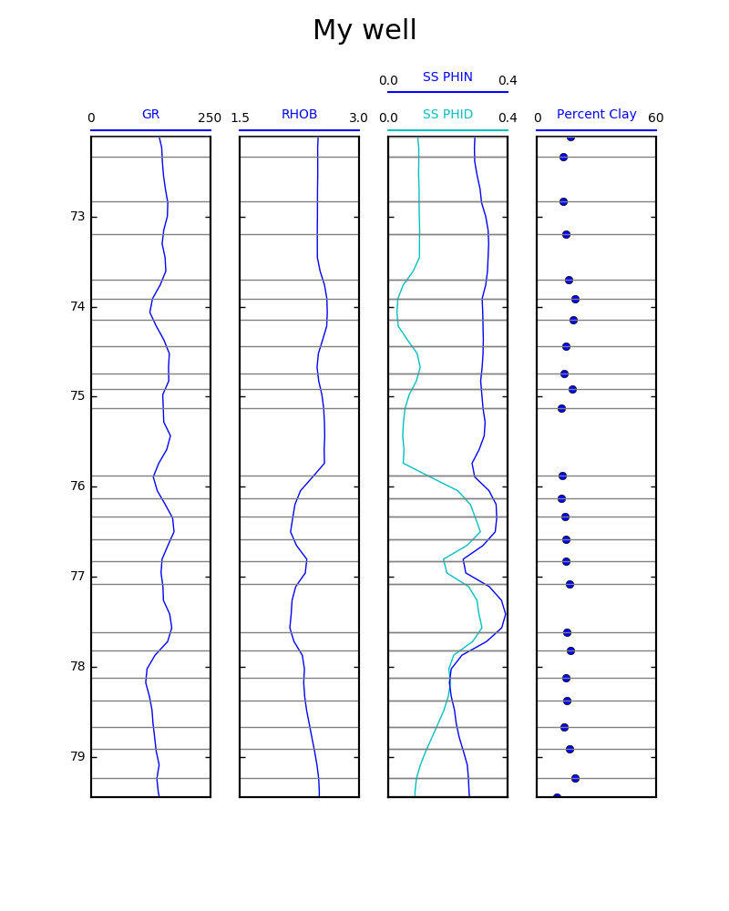

# matplot-well-log
Simple well log plotting using Python and matplotlib

Right now there is just an mpwell function that gets called. At some point,
I should really refactor this code so that there are Trace and Track
objects

```python
from mpwell import mpwell

trace11 = {'data': dfB, 'curve': 'GR', 'range': (0, 250)}
track1 = {'traces': [trace11]}
trace21 = {'data': dfB, 'curve': 'RHOB', 'range': (1.5, 3.0)}
track2 = {'traces': [trace21]}
trace31 = {'data': dfB, 'curve': 'PHID', 'label': 'SS PHID', 'color': 'c', 'range': (0, 0.40)}
trace32 = {'data': dfB, 'curve': 'PHIN', 'label': 'SS PHIN', 'range': (0, 0.40)}
track3 = {'traces': [trace31, trace32]}
trace41 = {'data': xrd3df, 'curve': 'total_clay', 'label': 'Percent Clay', 'ls': 'None', 'marker':'o', 'range': (0, 60)}
track4 = {'traces': [trace41]}
tracks = [track1, track2, track3, track4]
xrd_depths = xrd3df['depth']
log = mpwell(tracks, 'My well', min(xrd_depths), max(xrd_depths), xrd3df['depth'])
```


